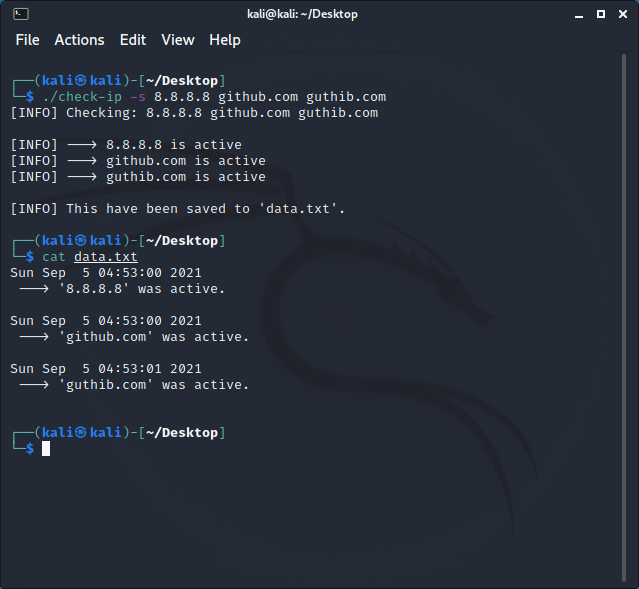

# About
A simple alternative to [fping](https://github.com/schweikert/fping).

Simple C program that checks ip adresses or websites are active or not, using shell "**ping -c 2**" command.

# How to use
```
Usage: ./check-ip [OPTION] IP_ADRESSES_TO_CHECK
Options:
-s            Save data to data.txt
-h, --help    Get help text
```

# Example/Screenshot
<br>

</p>
