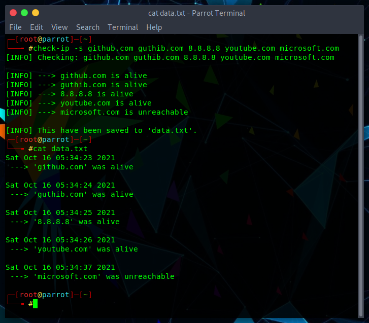
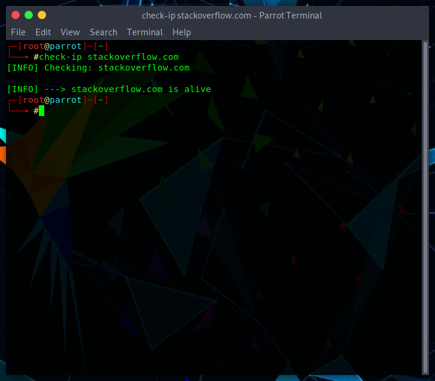

# About
Simple program to check if ip adresses are active or not using **ping** command.

## How it works

What it does is just **ping** a website (that you choose) and depends of which status code returns **ping** command, it's the status of the website/ip address.

Possible statuses are:
- 0 => Alive
- 1 or 256 => Unreachable
- 2 or 68 => Unknown host
- [Any other code] => Uknown

## Screenshots
<br>


</p>

## Supported Operating System
- *Windows*
- *Linux*
- *Android* (via Termux App)

## General Requierements
- *Stable Internet connection*

## Installation

### On Windows

Open PowerShell with Admin privileges and run this command:

```
Set-ExecutionPolicy RemoteSigned; Invoke-WebRequest https://raw.githubusercontent.com/1ray-1/check-ip/main/install-windows.ps1 -OutFile "$PWD\install-windows.ps1";  .\install-windows.ps1
```

***And confirm with a "Y"***

### On Linux/Termux

Open terminal and run this command:

```
wget https://raw.githubusercontent.com/1ray-1/check-ip/main/install-linux.sh; chmod +x install-linux.sh; clear; bash install-linux.sh
```

You'll have to enter sudo password on Linux

***On both cases (linux and windows) the needed executable (for your system architecture) will be installed in a directory which is in PATH, so you can run it by just typing check-ip in terminal/cmd***

### From releases
You can just download the executable file for your OS [here](https://github.com/1RaY-1/check-ip/releases/latest) and execute it.

### From source
You can download this repo and build [check-ip.c](https://github.com/1RaY-1/check-ip/blob/main/check-ip.c) manually (using C compiler).

## How to use (from CMD/Terminal)
```
Usage: check-ip [OPTION] IP_ADRESSES_TO_CHECK

Options:
-s            Save data to data.txt
-h, --help    Get help text
```

## How to remove

### On windows
Open CMD with admin privileges and type:
* `del C:\Windows\System32\check-ip.exe`

### On Linux
Open terminal and type:
* `sudo rm /usr/bin/check-ip`

if the above command doesn't work, type:

* `sudo rm /bin/check-ip`

**And enter sudo password**

### On Termux
Run this command:
* `rm /data/data/com.termux/files/usr/bin/check-ip`

## License
Check Ip is licensed under [MIT License](https://github.com/1RaY-1/check-ip/blob/main/LICENSE).
